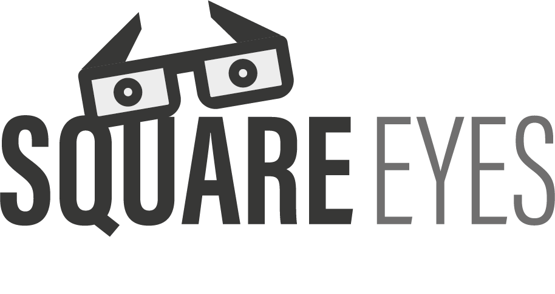

# Test-Veskje
<!DOCTYPE html>
<html>
  <head>
    <title>My first website | Home</title>
    <meta name="description" content="Webpage for movies." />
    <meta name="viewport" content="width=device-width, initial-scale=1.0" />
  </head>
  <body>
    <h1>Square Eyes</h1>
    <header>
        
Hello

      
      <nav>
        <ul>
          <li>Home</li>
          <li>About</li>
          <li>Contact</li>
        </ul>
      </nav>
    </header>
    <main>
      <section>
        <h2>Square Eyes</h2>
        

          Welcome to my website. Here I'll be putting into practice all the things I've learned.
        

      </section>
    </main>
    <footer>
      

        If you need more info, you can
        <a href="https://twitter.com">find me on Twitter</a>
      

    </footer>
  </body>
</html>